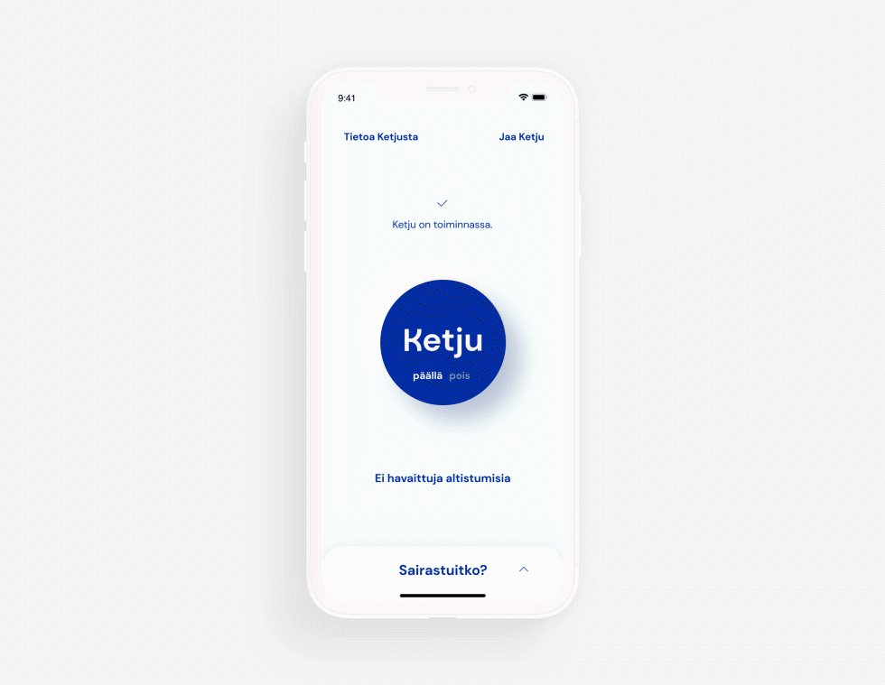
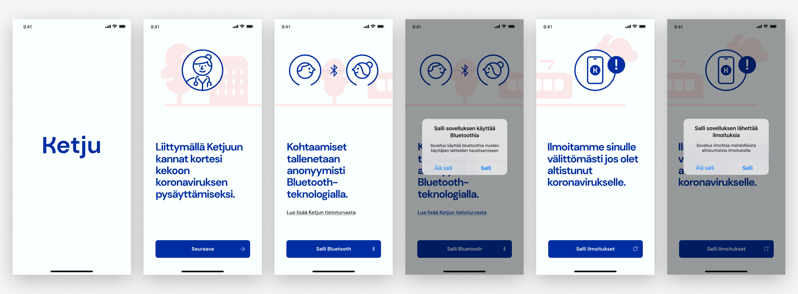
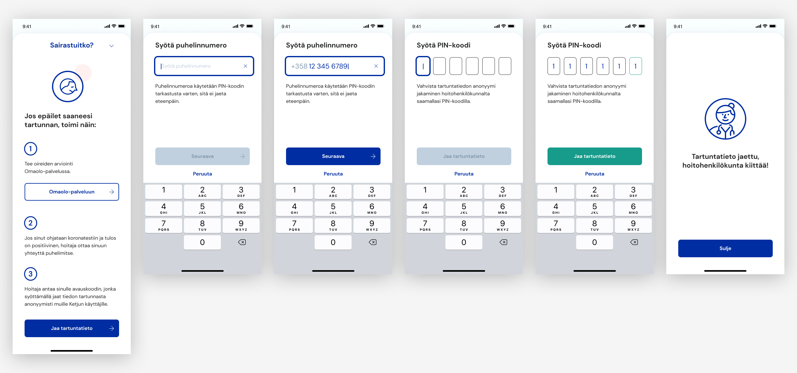
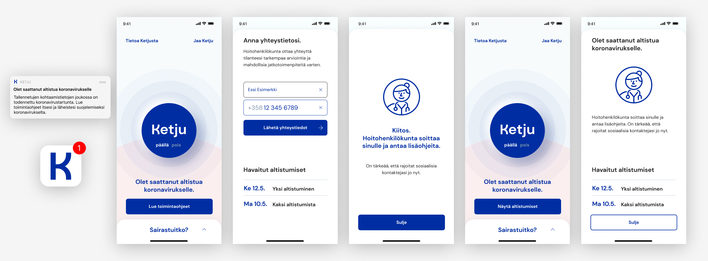
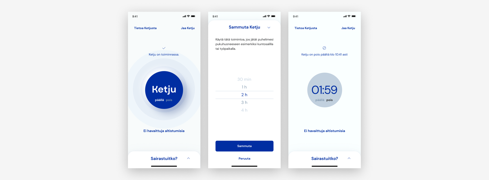
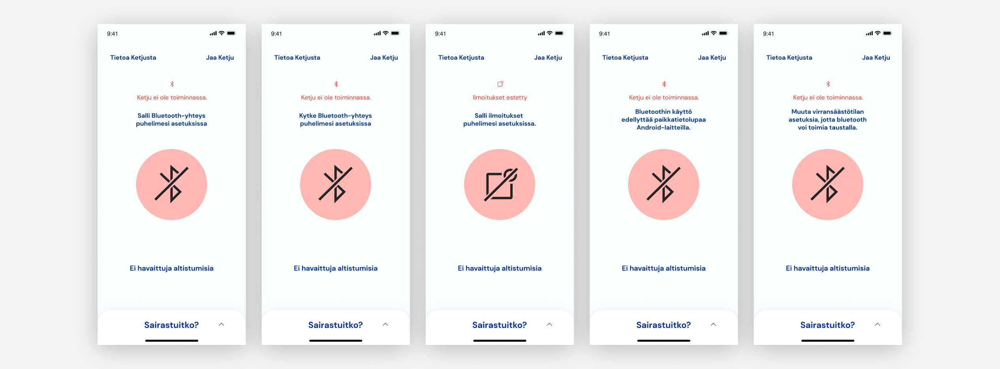
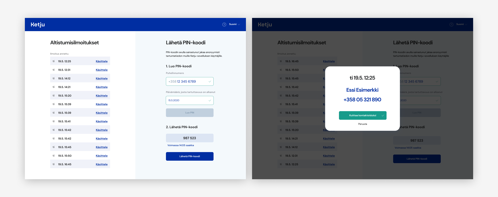

# Ketju-sovelluksen käyttöliittymäkuvaus

## Sovelluksen suunnittelun pääperiaatteet

Ketju-sovelluksen käyttöliittymän, ulkoasun ja käyttökokemuksen suunnittelutyötä ohjaavat sekä alalla hyväksi todetut käyttäjäkeskeisen suunnittelun periaatteet että projektissa erikseen määritellyt tavoitteet.

Sovelluksen tulee olla selkeä, saavutettava, helppokäyttöinen, luotettava ja inhimillinen. Tämä tarkoittaa muun muassa, että:

- vakiintuneita toimintatapoja (konventioita) hyödynnetään käyttöliittymällisiä toimintoja suunnitellessa.

- tekstin luettavuus varmistetaan mm. huomioimalla riittävä tekstikoko ja kontrasti 

- varmistetaan, että esimerkiksi näkövammaisten käyttäjien ruudunlukuohjelmat tai muu avustava teknologia pystyy tulkitsemaan sivun sisältöä oikein ja käyttäjä pystyy hyödyntämään verkkopalvelun toiminnallisuuksia.

- eri ruutukoot, puhelinmallit sekä -käyttöjärjestelmät huomioidaan.

- näkymien tulee olla rauhallisia, käyttöä ohjaavien tekstien napakoita ja ohjekuvien yksiselitteisiä.

- yleisilmeen tulee olla visuaalisesti viimeistelty, tasapainoinen ja johdonmukainen. Esimerkiksi kaikki sovellukseen liittyvä viestintä ja ohjeistus tulee olla tunnistettavaa ja määritellyn brändin mukaista.

- vaikka kyseessä on yhteiskunnallisesti kriittinen, tärkeä ja virallinen sovellus, tulee sen suunnittelutyössä ja toteutuksessa huomioida tietty inhimillisyys ja lähestyttävyys.

## Sovelluksen päänäkymä

## Perehdytys

Kun sovellus avataan ensimmäisen kerran, ohjataan käyttäjä antamaan lupa Bluetoothin ja ilmoitusten käyttöön.

## Tartunnan anonyymi ilmoittaminen

Tieto positiivisesta koronatuloksesta jaetaan muille sovelluksen käyttäjille anonyymisti kohdasta "Sairastuitko?". Tarvittavan PIN-koodin saa hoitohenkilökunnalta positiivisen testituloksen yhteydessä. Puhelinnumeroa käytetään vain PIN-koodin tarkastukseen, eikä sitä jaeta tai tallenneta.

## Ilmoitus mahdollisesta altistumisesta

Mahdollisesta altistumisesta ilmoitetaan käyttöjärjestelmän ilmoituksella sekä viestillä sovelluksen sisällä. Käyttäjä ohjataan antamaan yhteystiedot, jotta tilanne voidaan arvioida hoitohenkilökunnan toimesta.

## Ohjelman sammuttaminen

Jos käyttäjä jättää puhelimen esimerkiksi pukukoppiin, sovelluksen voi sammuttaa määräajaksi, jottei syntyisi turhia kontakteja muista pukukoppeihin jätetyistä puhelimista. Jotta sovellus ei unohtuisi sammuksiin, se käynnistetään uudestaan määräajan jälkeen.

## Virhetilat

## Viranomaisnäkymä

